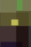
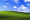
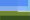

# pop

Genetic algorithm to approximate a target image using semi-transparent rectangles.

Inspired by [this blog post](https://rogerjohansson.blog/2008/12/07/genetic-programming-evolution-of-mona-lisa/) and [this book](https://natureofcode.com/book/chapter-9-the-evolution-of-code/).

## How it works

1. Generate a number of DNA elements with randomly sized and colored rectangles.
2. Repeat the following:
    1. Calculate a fitness value for every element by comparing it to the target image.
    2. Repeat the following until a new population of the same size is created:
        1. Select two elements while favoring elements with high fitness value.
        2. Combine the two elements into a new DNA element.
        3. Randomly mutate the newly created DNA.

## Example

After waiting for a good ten minutes we get something that vaguely resembles the Mona Lisa:

On the other hand, it can replicate a red square quite easily:

And it gets quite close to the Windows XP wallpaper as well:

